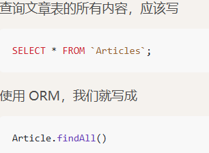
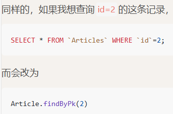
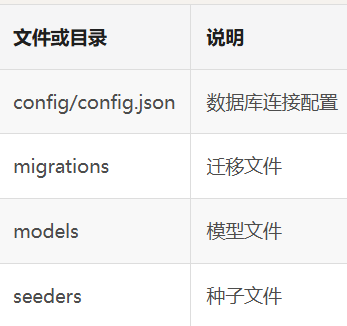

# 基于Node开发的课程系统后端接口


## nvm 使用
  - nvm list available   (最新的Node.js LTS的版本号，**LTS也就是长期支持版本**)
  - nvm install [version]  (下载)
  - nvm use [version] (使用 && 切换版本)
  - npm config set registry [URL]  (更换镜像)

## express
  - express --no-view [projectName] (--no-view参数，不需要任何视图模板，此项目专门做后端接口)
  

## sequelize ORM 学习
- 
- 
- sequelize init
  - 
  
- 具体步骤

|步骤	|命令|	说明|
| --- | --- | --- |
|第一步	|sequelize model:generate --name Article --attributes ...|	建模型和迁移文件|
|第二步|	人工处理	|根据需求调整迁移文件
|第三步|	sequelize db:migrate|	运行迁移，生成数据|表
|第四步|	sequelize seed:generate --name article	|新建种子文件
|第五步|	人工处理	|将种子文件修改为自己想填充的数据
|第六步|	sequelize db:seed --seed xxx-article	|运行种子文件，将数据填充到数据表中


# 注意点
- 接口获取数据需要主要是否是异步操作(async await)
- 查询文章详情接口
  - 配置 **:id** 这种路由，用来接收接口中的参数,通过 **req.params**
  - 查询单条数据，可以使用**findByPk**
- 创建文章
  - 使用create()
- 删除文章
  - 先获取id才能删除
  - 使用destory()
- 更新文章
  - 先通过id查看是否有
  - 再通过update()更新(异步)
- 模糊搜索
  - 引入const { Op } = require('sequelize');
  - 相当于SQL语句select * from Articles where title like '%标题 10%' <------>`[Op.like]: `%${query.title}%`
- 数据分页
  - 实现分页，用户需要传递**currentPage和pageSize**(当前页  数据条数)两个参数
  - 然后通过这两个参数，计算出offset(起始数)
  - 再使用**findAndCountAll**方法进行查询
  - 返回了count和rows(数据总数 数据)，rows里才是真正查询到的结果
- 白名单过滤
  - 封装公共函数,从req中取出title和content作为需要的参数传入
- 验证表单数据
  - 文档地址:  https://sequelize.org/docs/v6/core-concepts/validations-and-constraints/
  - 在model中对字段进行约束
  - 错误信息通过error.errors数组取出错误message
  - 返回客户端就行
- 何为 **DRY** 原则(Don't Repeat Yourself)
  - 对于常用的，重复性高的代码，可以做一个封装。
- 项目开发流程(个人经历)
  - 编写需求文档
  - 原型和UI设计
  - 确定数据库的表 字段以及接口地址和数据
  - 同时进行：前端mock开发、后端开发接口
  - 接口开发完成后，将mock地址，换为接口地址
  - 测试、上线部署
- 建立数据库表
  - 回滚迁移
    - 数据不重要
      - 直接删除数据库中的表 --> 修改迁移文件并重新运行
    - 数据重要
      - 增加另一个迁移文件,调整各个表的字段
  - 完成:建立模型和表
  ## 个人总结学习
- **模型文件**是 Sequelize 中用于定义数据库表结构和数据操作的核心部分
  - 定义表结构：在模型文件中，通过 Sequelize 的 API 来定义数据库表的字段、数据类型、约束条件等。
  - 实现数据操作：模型文件中可以定义各种方法来进行数据库的增删改查操作（CRUD）。(finaAll findByPk  create destory)
  - 定义关联关系：在实际应用中，数据库表之间通常存在关联关系，如一对一、一对多、多对多等。在模型文件中，可以使用 Sequelize 提供的方法来定义这些关联关系，以便在查询数据时能够方便地获取相关联的数据。
- **迁移文件**
  - **sequelize db:migrate**是 Sequelize 用于执行数据库迁移（Database Migration）操作的命令
  - **sequelize db:migrate:undo** 命令用于撤销最近一次执行的数据库迁移操作
-**种子文件**
  - 编写种子文件（通常位于项目的 seeders 目录下）来定义这些初始数据，并使用 **sequelize db:seed** 命令插入到数据库中
  - **sequelize db:seed:undo** 命令可以撤销上一次种子命令插入的数据

### git restore --staged (恢复文件状态,移出暂存区)
- **--staged** 参数表示 “从暂存区移除，但保留本地文件的修改”（不会删除你的文件内容）
### git commit --amend  (适合未push操作)
- 打开vim编辑器   -->  按 **i** 进入编辑模式 → 修改内容 → 按 **Esc** → 输入 **:wq** 保存退出
### git reset HEAD~1
- **保留代码，只撤销提交记录**   git reset --soft (相当于git add 未 git commit)
- **保留代码，但取消暂存**  git reset --mixed  (相当于未git add)
- **完全丢弃提交和代码** git reset --hard

## 对于已经push的操作
### 修改最后一次提交
- git stash --> git add **要修改的文件** --> git commit **--amend** --> git push **--force**(强制上传) --> git stash pop
- --amend 命令修改最近一次提交，会保留原提交的作者和时间，只更新内容 / 提交信息
- --force  由于修改了已推送的历史，普通 "git push" 会失败，需要用 **--force 强制覆盖远程对应提交**

## 参数传递
### params
- **Path 参数：是URL 路径的一部分**，用于动态标识资源。
- **Query 参数：是跟在 URL 问号（?）后面的键值对**，用于对请求进行过滤、分页等额外说明。
### 其他
- Body 参数（请求体）,放在 HTTP 请求的 Body 中，不在 URL 里
  - 用途：传递大量数据或复杂结构（JSON、表单等）
    - application/json
       ```json
       {
        "username": "test",
        "password": "123456"
       }
       ```    
    - application/x-www-form-urlencoded
       ```plaintext
       username=test&password=123456
       ``` 
    - multipart/form-data（上传文件时用）
- Header 参数（请求头）放在 HTTP 请求头（Header）中
  - 用途：传递元数据（metadata），比如认证信息、内容类型等
    ```
    Authorization: Bearer <token>
    Content-Type: application/json
    ```
- Cookie 参数  放在 HTTP 请求头的 Cookie 字段中
    ```plaintext
     Cookie: sessionId=abc123; theme=dark
    ``` 

## 系统设置接口
- 只需要查询和更新接口
- 通过findOne()查询设置表的第一条记录即可(或者 fingByPk(1))
- 白名单过滤获得各个接口需要的字段(用户接口  分类接口   设置接口 都有自己独有的字段)

## 其他问题
- model使用unique验证
  - 使用unique验证，必须要给字段加唯一索引。
  - 出错后，异常的名字是**SequelizeUniqueConstraintError**，而不是SequelizeValidationError。也就说要去resonses.js里增加另一个判断。
  - 不能通过msg自定义提示信息

## 用户接口
- 邮箱、用户名和用户组，都是用的**eq**，也就是等于的意思，这是做的精确查找，而昵称用了模糊搜索**like**。
- [Op.eq]: query.email   [Op.like]: `%${ query.nickname }%`
### 使用 bcryptjs  加密password
**注意点**
- 加密这个步骤，可以在**路由文件里的创建和更新用户**两个地方写这些代码,但是数据验证的时候，特别是长度验证这里。验证的就不是用户实际输入的密码长度，而是加密后的密码长度，这样就验证错了。
- 在模型中添加set方法,在验证之后再对密码进行加密(this.setDataValue('password', bcrypt.hashSync(value, 10));)


## 课程接口
- 每个课程都是是属于一个分类的，每个课程也是属于某一个用户的。所以这里的**categoryId和userId**在**分类表和用户表中，必须有对应的ID值**。
- 添加了一个自定义验证**isPresent**，通过用户过传递过来的categoryId和userId去分类表和用户表里查了一下，确保提交的数据有对应的分类和用户。
- 在验证里，要用到其他模型，前面要加上sequelize.models    (sequelize.models.Category.findByPk(value))

## **课程接口（关联模型）**
- 这些**表与表之间的关系**，在**Sequelize**里就叫**关联模型**（Associations）。
  - 如果没有关联模型,需要自己写SQL
  - 使用关联模型  只需要在模型里定义一次关系：
    ```javascript
    static associate(models) {
      models.Course.belongsTo(models.Category);
      models.Course.belongsTo(models.User);
    }
    ```
  - 查询的时候直接：
    ```javascript
    Course.findByPk(1, {
      include: [Category, User]
    });
    ```
  - 会自动生成嵌套对象
    ```json
    {
    "id": 1,
    "title": "Node.js入门",
    "CategoryId": 2,
    "UserId": 5,
    "category": { "id": 2, "name": "后端开发" },
    "user": { "id": 5, "username": "admin" }
    }
    ``` 
  - 加了 hasMany 之后，我们就可以反向查询：
      从分类查它下面的所有课程
      从用户查他创建的所有课程

## 孤儿记录问题处理
- 数据库里添加外键约束 (产生额外开销  性能瓶颈)
- 代码层面处理,删除分类时,将分类关联的所有课程删除(不合理)
- 删除分类时,查询有没有关联的课程,存在,就提示不能删除

## 关联关系总计
- 查询关联表的数据，可以**在模型中定义关联关系**。然后查询代码中，使用**include**就可以查询到对应的关联数据了。
  可以用**attributes**，来查询指定的字段，而不用查询出所有字段。
  可以在attributes里，添加**exclude**，来排除部分不想查询的字段。
  关联里，可以用**as**来定义别名。但是记住，如果模型里定义了as，**在查询时，也一定要加上as**

## 管理员登录验证接口
- 密码在数据库里，都是加密形式存在的，所以不能直接对比是否相等。 使用**compareSync**方法
- 登陆验证(邮箱 || 用户名登录) --->验证密码  ---> 验证是否是管理员 **ENDDING**
  
## jwt生成token
```json
jwt.sign({
  data: 'foobar'
}, 'secret', { expiresIn: '1h' });
```
- 中间的data：是要生成token的数据。
secret：自定义秘钥。
expiresIn：有效期
- 使用node自带**crypto**生成随机字符串

## 中间件
- 就是在运行某一个方法之前，我们**必须**要先去运行的方法。
- **token验证方法**: jwt.verify(token, process.env.SECRET);
- **一定要加上next(),才能进入后续路由**

## user对象挂载到req上的作用
- 创建文章这里，接受了一个userId。这个值，是用户通过表单传递过来的，这其实是不对的。
  应该是谁登录了，那就是谁发布的课程。所以白名单里，修改一下， 不要接受userId值了
- 创建方法里也做一个修改，userId改为从req.user中获取。这个值就是当前登录用户的 ID
## 首页、分类、课程接口
- 前台的接口开发比较简单，以查询为主
- 注意点
  - 课程接口中必须有分类 ID，才能查询对应的课程，否则就报错
  - 加入了分页代码
  - 使用 moment.js 处理时间(现在可以使用dayjs或者其他方式)

## 章节、文章、系统信息、搜索接口实现
- 多级嵌套关联实现
  ```json
  include: [
        {
          model: Course,
          as: 'course',
          attributes: ['id', 'name'],
          include: [
            {
              model: User,
              as: 'user',
              attributes: ['id', 'username', 'nickname', 'avatar', 'company'],
            }
          ]
        }
      ]
  ```
## 用户注册、登录接口以及用户登录中间件
- 注册成功后需要返回信息不需要密码
- 使用**user**对象的**dataValues**中，**delete**掉密码字段，这是**sequelize里的固定用法**。
  - delete user.dataValues.password; // 删除密码
- 前台无论是普通用户，还是管理员，都是可以登录
- Apifox获取到token后，通过后置操作，将获取到的token保存到环境变量中(userToken)
- 用户页面、用户信息修改、点赞功能，都需要在认证后才能访问接口(user-auth)

## 用户点赞接口(多对多关联)
- **increment和decrement**:对数据库中的数据，进行自增、自减操作 (course.increment('likesCount'))
- **多对多关联要通过belongsToMany**来定义，定义中需要加上**foreignKey**
- **关联定义好**后，sequelize就会**自动定义出get、count等等方法**，方便使用
- 查询多对多关联时，可以使用**joinTableAttributes: []**来排除掉中间表

## SSH使用教程
- 公网ip:服务器地址  内网ip:XX云内部通信使用
- 连接服务器:ssh root@公网ip
### 密钥方式登录
- **ssh-keygen -t rsa**(生成密钥对)
- 密钥存放路径:  Windows:C:\Users\你的用户名\.ssh    macOS：open ~/.ssh
- id_rsa:私钥   id_rsa_pub:公钥
- 查看公钥:**cat ~/.ssh/id_rsa.pub**
- 公钥上传XX云  在云服务器上创建密钥对
#### 对于多个服务器如何解决登录密码问题
- macOS 用户，使用命令行创建：**touch ~/.ssh/config**
- Windows 用户，创建一个叫做**config.txt**的文本文档。删除扩展名改为**config**
```ssh-config
Host  主机名
   HostName  公网IP
   User  用户(root||自定义用户)
```
- 直接连接   ssh    主机名


## 问题
- 科学上网时可能修改IP地址导致无法**通过该ip访问宝塔**,建议**源选中全部IPV4**

### Chapter 接口修复(admin/chapters)
- chaptersCount，用来统计每个课程，有多少个章节。之前的开发中并没有使用到。
- 基础逻辑:每增加一个章节，对应课程的chaptersCount + 1。删掉一个章节，那么就chaptersCount - 1

### 查询用户列表修复(admin/users)
- 多条件查询时，条件会被 “覆盖”
- 修复方式：初始化 condition.where 为一个空对象，然后通过直接添加属性的方式合并条件
### 后台查询当前登录用户接口
- 用于查询当前登录的用户的接口。因为一般在管理后台页面的右上角，会显示出当前登录的用户是谁
- 新增的方法，必须在/:id路由的上方。因为路由是按顺序依次匹配的，上面的匹配到了，就不会继续向下匹配。如果将/me方法，丢在下面。访问接口的时候，就只会先匹配到/:id方法，它会把**me当成是一个id值**来进行查询的，产生错误。

### 知识点
- 原型链:构造函数上的显式原型prototype属性和实例对象上的隐式原型__proto__属性指向同一个原型对象，原型对象上面还有隐式原型__proto__指向上一层的原型对象，直到object.prototype上的__proto__为null为止。中间所形成的链为原型链。
- typeof:基本类型的检测
- instanceof:作用：检测某个对象（引用类型）是否属于某个类型。
  场景：检测（引用）对象的类型，
  参数：object（要检测的对象）instanceof constructor（某个构造函数）
  本质：instanceof运算符用来检测constructor.prototype是否存在于参数object的原型链上。如果存在，返回true；否则返回false

### 错误验证
- **models/user.js模型中的set方法**。这里也有new Error。但是set里的东西，就**不属于Sequelize的自定义验证**(**不会被Sequelize转成SequelizeValidationError**)了。也就说，不会被转成SequelizeValidationError
- 所以使用 BadRequest

### 附件管理接口
- 增加关联关系
  - 每个用户都有很多附件，每个附件都属于某一个用户。
    - models.Attachment.belongsTo(models.User, { as: 'user' });
    - models.User.hasMany(models.Attachment, { as: 'attachments' });
- 客户端上传接口增加上传记录
- 附件管理模块
  - 可以列出来所有的附件信息，还要显示关联的用户头像。
  - 删除附件
    - 1.先删除阿里云OSS中的文件(client.delete)
    - 2.删掉数据库中的附件记录

### 客户端直传上传文件接口
- 使用uuid生成唯一识别码
- 1.使用GET 接口：/uploads/aliyun_direct  获取阿里云 OOS 授权信息
  - 后置操作存放好
    ```json
    AliyunPolicy：data.policy
    AliyunSignature：data.signature
    AliyunAccessid：data.accessid
    AliyunKey：data.key
    ```
  - url，就是完整的文件访问地址
- 2.使用上传接口上传到阿里云 OSS
  - 返回状态码204，但是没有返回任何提示信息。但是其实已经成功
- 在Vue或者React项目里上传，会出现跨域错误
  - 在阿里云OSS 跨域设置中设置跨域规则
    ```json
    来源：*
    允许 Methods：POST
    允许 Headers：*
    ```
#### 骚操作
- 在图片处理中 在图片路径之后加上参数,可以显示处理后的图片(裁剪 加水印)  还可以设置防盗链
- 静止公开访问 --> Bucket设置未私有 --> 域名管理绑定自定义域名 + SSL证书 + 开启CDN加速(在各个机房缓存,提高访问速度)    这样之后用户必须通过CDN访问(访问CDN的米 < 访问OSS的米)

##### Apifox上传中文文件出错
- public/demo下创建oss_direct_upload.html文件夹测试